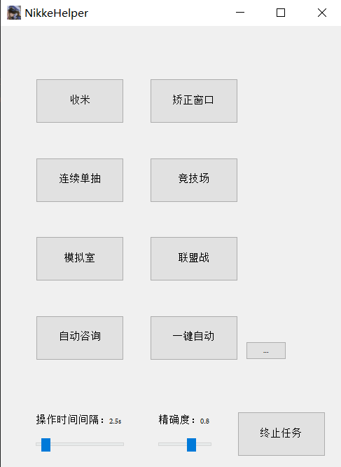

# NIKKE-helper
本菜鸡参照[auto_player](https://github.com/anywhere2go/auto_player)仓库的大佬写的模板制作的此脚本。   
适用于PC端，使用窗口模式4:3，且**窗口大小需调至803x1021**，不能遮挡游戏画面，界面保持在大厅即可。  
自动单抽需要在抽卡界面，且不支持活动抽卡（懒得截图了）。   
### 必须需要**管理员权限**，否则无法实现点击。

不是很懂python，觉得好玩而制作的，顺便学学pyside。

### 安装依赖包
pip install -r requirements.txt   
随后运行main即可。   
或者下载打包好的程序运行也行。

**图片预览：**

暂时就搞了这些，，，
