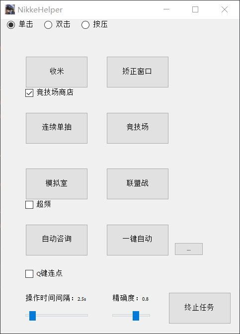

# NIKKE-helper
本菜鸡参照[auto_player](https://github.com/anywhere2go/auto_player)仓库的大佬写的模板制作的此脚本。   
适用于PC端，使用窗口模式4:3，且**窗口大小需调至1021x803**，不能遮挡游戏画面，界面保持在大厅即可。  
提前配置好要使用的各个队伍。
可依据个人网速选择合适的点击模式。
自动咨询自动选择列表里第一个角色和第一个咨询选项，需要提前标记好需要咨询的所有角色。   
模拟室默认选择 5 C 难度。
一键自动旁的按钮可设置想要进行的任务（联盟突袭、单突）。
自动单抽需要在抽卡界面。  
勾选q键连点可长按q键实现连点（爱丽丝、充能）。
### 必须需要**管理员权限**，否则无法实现点击。

不是很懂python，觉得好玩制作的，顺便学学pyside。

### 安装依赖包
pip install -r requirements.txt   
随后运行main即可。   
或者下载打包好的程序运行也行。

**图片预览：**

